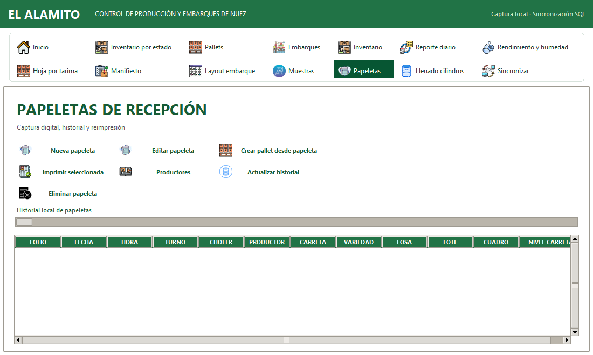

# AgroChek ERP 7.0.00 — compilación 20261007.01

Agregué «Eliminar papeleta» en Captura Nuez → Papeletas. Selecciono la fila y confirmo su folio para retirar una captura guardada por accidente.

Conservo el registro como cancelado, su identidad, el folio y la bitácora. Envío la cancelación mediante la cola existente; no reutilizo el folio ni borro evidencias. Bloqueo la cancelación si existen pallets o llenados vinculados. Para una papeleta recibida del portal u otra PC, indico que debe revisarse en su origen; este botón cancela capturas propias de escritorio.

Compruebo que la recepción de la cancelación retire una papeleta de otra PC cuando no tiene vínculos, y que una respuesta antigua no la reactive. Las versiones anteriores deben actualizarse para interpretar la cancelación.

No cambié configuración ni datos de producción. La validación de esta entrega usa carpetas aisladas. Nómina y el cierre del transporte del puente conservan sus pendientes; esta entrega no los presenta como terminados.

Agregué iconos a Eliminar papeleta y los controles Consultar, Revisar vínculos, Iniciar temporada y Finalizar temporada. Descargué dos recursos nuevos de Flaticon, con atribución a HAJICON y Magnific; conservo las imágenes originales existentes en las demás acciones.

Extendí la asociación de iconos para búsqueda, calendario, adjuntos, consulta de merma, decisiones compartidas, mensajes y actualización en línea. Conservo los comandos y los permisos de los controles existentes.

## Vista revisada

Capturé esta pantalla en una base vacía de validación; no representa registros de producción.

## Créditos de los recursos nuevos

- Eliminar documento: HAJICON — Flaticon, https://www.flaticon.es/icono-gratis/eliminar-documento_9344901
- Calendario: Magnific — Flaticon, https://www.flaticon.es/icono-gratis/calendario_2370279

Uso con atribución según las páginas consultadas el 7 de octubre de 2026.

## Alcance de las pruebas

Aprobé 16 pruebas focalizadas de cancelación, historial, impresión separada, controles de temporada e iconos, y una prueba adicional de asociación de los botones de puente/actualización. Probé los estados de cancelación recibidos con SQLite aislado. No hice escrituras de producción ni presento esta validación como un recorrido físico entre varias PCs.

Verifiqué el ejecutable final en tres perfiles aislados y su arranque real con base vacía en una sola PC.

Aprobé actualización desde .14, reapertura, integridad y conservación de base principal, otra base SQLite, contrato y respaldo en una variante QA del instalador. Aislé registro, cifrado/compresión, accesos directos y respaldo para esta prueba. No ejecuté el instalador de entrega sobre la instalación operativa.
